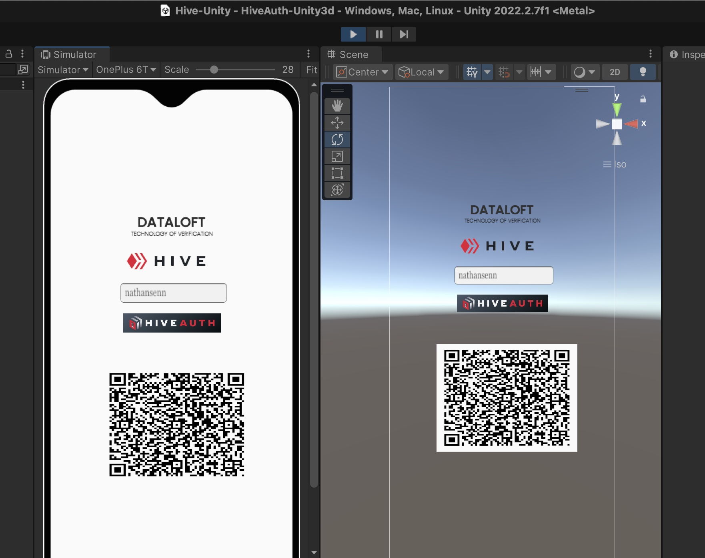

# HiveAuth-Unity3d
This is a sample Unity3D project demonstrating how to integrate HiveAuth into your Unity project for user authentication.

# License
GNU General Public License v3.0

# Contact
nathan@d.buzz

# Contributors
https://github.com/vishyte

https://github.com/nathansenn

# Funding
https://3speak.tv/user/theycallmedan funded the integration of HiveAuth into Unity3d

# Additional Information:
For more information and detailed documentation on how to use HiveAuth, you can refer to the official HiveAuth documentation at https://docs.hiveauth.com/. The documentation provides comprehensive guides and tutorials on how to get started with HiveAuth, integrate it into your project, and use its features to authenticate users.

# HiveAuth Funding
If you find this implementation useful, consider supporting HiveAuth hive proposal for funding at https://peakd.com/hive-139531/@arcange/hiveauth-proposal-2.

## References

- [HiveAuth Update .Net](https://peakd.com/hive-139531/@arcange/hiveauth-update-dotnet)
- [HiveAuth DotNet GitHub Repository](https://github.com/hiveauth/hive-auth-dotnet)
- [HiveAuth Website](https://hiveauth.com/)

